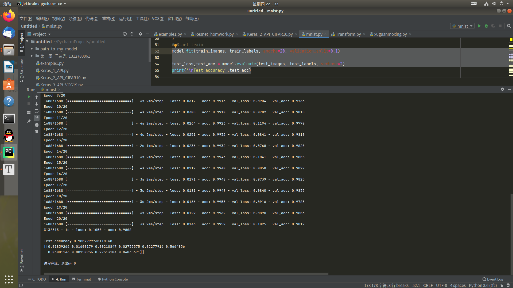

# 第一周作业

## 1.第一题：mnist手写数字识别

1.代码line11-- [mnist.py](第一周代码及图片/mnist.py) 

2.代码line29

3.如下

4.九个图层，不算输入输出使用了七个全连接层，没考虑卷积。

5.思路：不用卷积层，全连接层一路走到黑，层数深一点点（试了几次感觉7层左右挺好，再多了容易过拟合），20个epoch，最终98%左右.

6.

7.把epoch改成1，围观人工智障，只有19%确信度7是9 ...

## 2.第二题：My_Mini_ResNet

1.见代码 [Resnet_homwork.py](第一周代码及图片/Resnet_homwork.py) 

2.根据课上代码随便加了连个卷积层，准确率75左右，图片73%,加epoch高的忘了截图..

3/4.emmm,这么个鬼东西，凑活演示可还行.

5.checkpoint文件和权重文件见附件： [checkpoint](第一周代码及图片/checkpoint) / [Mini_Resnet_saveweights.data-00000-of-00001](第一周代码及图片/Mini_Resnet_saveweights.data-00000-of-00001)  [Mini_Resnet_saveweights.index](第一周代码及图片/Mini_Resnet_saveweights.index) 

6.看上去开始过拟合，20个epoch说明比较极限了,在我自己的模型下。

## 3.一些想法

​         自己不是做深度学习相关的，但是做过的项目和身边的亲戚朋友的人好多都在搞这个，通过第一周学习，自己用几个简单的数据集构建

的几个网络来看，深度学习坑深水深，想要得到自己想要的准确率还是挺难的，炼丹路慢慢其修远兮.......

