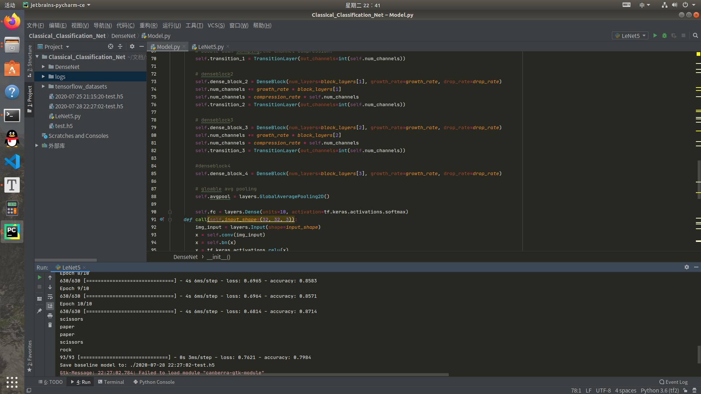
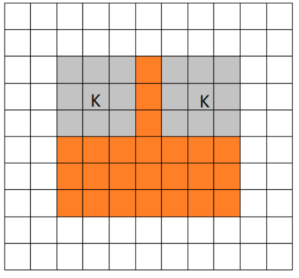

# 第二周作业

## 1. ResNet50 Structure

## 2. Data Augmentation

数据增强的说法正确，自己搜集的资料如下：

1.https://blog.csdn.net/kuweicai/article/details/106590031

2.https://zhuanlan.zhihu.com/p/41679153

## 3.ResNet

1.resnet优化了之前网络深度过深造成的梯度消失和梯度爆炸的问题。

2.解决了深层网络退化的问题。

解释参考了：https://www.zhihu.com/question/52375139

## 4. 

Lenet5

DenseNet

ResNet50

## 5.Activation function

将神经元线性组合的结果进行非线性的处理，这样就可以拟合复杂曲线。

## 6.Same Valid Full
1.same

2.valid

3.full

## 7.Characteristics of VGG
1.首先最明显的特点是:小卷积核
2.小池化核，相比AlexNet的3x3的池化核，VGG全部采用2x2的池化核。
3.通道数多，层数更深、特征图更宽

## 8.Characteristics of DenseNet

1.densenet通过通道concat而不是sum,既保留了低层的细节信息，省了参数有降低了计算量。

2.可以一定程度上缓解过拟合。

3.但是网上评价densenet比较消耗显存，而且每一层通道数不敢用太多，因此还是有相当不完美的地方？

